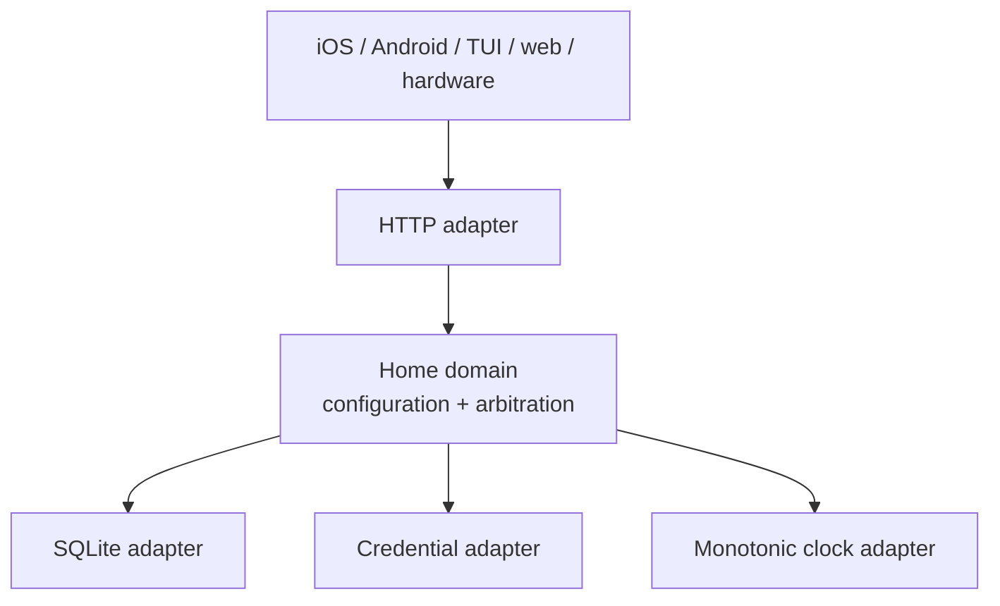
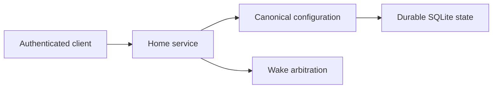

# Architecture Spine — Hermes Relay Home

## Design Paradigm

Use ports-and-adapters with small functional cores.

- Domain code owns configuration validation, revision rules, claim eligibility,
  and arbitration. It does not import an HTTP framework, SQLite driver, or
  client surface.
- Adapters provide HTTP transport, SQLite durability, credential lookup, and
  monotonic time.
- The wire contract is versioned independently of the Python implementation.



## Invariants & Rules

### AD-1 — The Home service is the sole household authority [ADOPTED]

- **Binds:** Configuration reads, configuration writes, and wake arbitration.
- **Prevents:** Clients becoming competing mutable authorities with divergent
  household state or winner selection.
- **Rule:** The service owns the active configuration revision and every
  arbitration decision. Clients may cache snapshots for presentation only;
  they never select a household-wide winner.

### AD-2 — The versioned contract is the wire authority [ADOPTED]

- **Binds:** HTTP requests, responses, errors, and persisted contract fixtures.
- **Prevents:** An HTTP framework or client platform becoming the source of
  truth for payload shape and compatibility.
- **Rule:** Versioned schemas and contract documentation define the accepted
  envelope, fields, and error codes. Adapters translate to and from the
  contract; they do not invent parallel payloads.

### AD-3 — Configuration publication is revisioned and atomic [ADOPTED]

- **Binds:** Full-snapshot configuration replacement and restart recovery.
- **Prevents:** Lost updates, partially active snapshots, and clients reading a
  revision that was never fully committed.
- **Rule:** A publish supplies `expected_revision`. The service validates the
  complete candidate before activation, rejects stale writes with a typed 409,
  and commits the new snapshot and revision as one durable transaction.

### AD-4 — Credentials stop at their owning boundary [ADOPTED]

- **Binds:** Admin routes, claim routes, logs, diagnostics, snapshots, and
  display/client adapters.
- **Prevents:** Bearer or device credentials leaking through ordinary data
  paths or content-bearing diagnostics.
- **Rule:** Home admin and device credentials are distinct, authenticated
  through an adapter, and never serialized into URLs, snapshots, payloads,
  transcripts, audio, or ordinary logs. Home owns enrollment, endpoint scope,
  expiry, replacement, and revocation decisions; the adapter owns only the
  chosen credential representation and lookup. Invalid identity fails closed.

### AD-5 — Arbitration is bounded, monotonic, and fail-closed [ADOPTED]

- **Binds:** Simultaneous wake claims and claim outcomes.
- **Prevents:** Duplicate turns, wall-clock races, late-claim surprises, and
  unsafe promotion of a failed winner.
- **Rule:** The first valid claim opens a 250 ms window measured by the Home
  service's monotonic receive clock. Eligible claims compare acoustic proximity
  evidence, then positive per-Room Device priority where `1` is highest. A
  denied, malformed, late, revoked, unavailable, or unmapped claim is denied;
  a failed winner is not replaced without a new wake.

### AD-6 — Domain policy remains independent of clients and infrastructure

- **Binds:** Domain modules, tests, and all future Home adapters.
- **Prevents:** A framework, database, iOS screen, TUI, or firmware target
  smuggling presentation or deployment assumptions into policy.
- **Rule:** Domain behavior is deterministic under injected clock, storage, and
  credential ports. HTTP, SQLite, and client-specific concerns remain at the
  edge. No generic Hermes core is extracted until multiple consumers prove the
  boundary is cheaper than their adapters.

### AD-7 — Enrollment and revocation are explicit Home state transitions [ADOPTED]

- **Binds:** CAP-6 through CAP-9, device administration, and every future
  authenticated endpoint adapter.
- **Prevents:** QR scanning becoming implicit trust, credentials being shared
  across endpoints, revoked devices retaining control, and stale actions
  mutating household state.
- **Rule:** A five-minute single-use enrollment code creates a pending request;
  an already trusted control-plane surface must approve it before Home issues
  one opaque credential scoped to one endpoint. Active, expired, replaced, and
  revoked credentials are distinct states. Revocation blocks new activity,
  interrupts reachable work, rejects late actions without mutation, and
  requires fresh authorization on reconnect. Issued credentials expire after
  90 days; Home offers renewal in the final 14 days and allows the replaced
  credential for at most 10 minutes to recover a lost rotation response.
  The renewal request ID is bound to the current credential generation so a
  retry returns the same replacement and cannot mint another one. Explicit
  revocation ends that overlap and retry path immediately. Home persists only
  keyed digests, keeps the root secret outside SQLite, and stores retryable
  replacement material only in a short-lived authenticated-encryption record.
  Endpoints require platform secure storage or fail closed. The first pilot
  approver is the existing TUI; phones later reuse the same review contract,
  and a display cannot approve itself. Exact primitives, store adapters,
  revocation retention, phone approval adapter, and precise TUI
  confirmation-code presentation or accessibility remain in the foundation
  spec's open questions.

### AD-8 — Profile mappings and conversation claims are Home-owned and immutable during active work [ADOPTED]

- **Binds:** CAP-1 through CAP-6 in `SPEC-profile-mapping-conversation-claims`, FR-31 through FR-33, and all wake-capable endpoints.
- **Prevents:** Endpoints choosing arbitrary Profiles, ambiguous household wake phrases, loser promotion, cross-Room interference, and a mapping edit retargeting an active conversation.
- **Rule:** Home defines the household-wide phrase-to-Profile meaning; a phrase maps to one Profile everywhere, while one Profile may have multiple aliases. Device authorization is an explicit visible set of per-device Wake Mapping grants; an “all current Profiles” approval expands to a snapshot, not a wildcard. A claim carries only the opaque mapping ID and authenticated device identity. Home arbitrates independently per Room using the existing 250 ms monotonic window, acoustic evidence, availability, and per-Room priority, then binds the winner to its device, Room, mapping, Profile, and Hermes Session. Separate Rooms may hold independent Sessions for the same Profile. Follow-ups keep the binding; a different wake cannot retarget it. The initial idle timer starts after response playback at the configured default of 8 seconds, resets after each non-empty follow-up, cannot expire an in-flight turn, capture, or playback, and closes on `stop`, disconnect, revocation, or expiry. Stale claims refresh; unavailable Sessions fail closed without fallback, promotion, or retry; an explicit Room move affects new wakes only.

### AD-9 — The Home bridge uses the supported Hermes session boundary [ADOPTED]

- **Binds:** FR-24 through FR-33, the Home bridge, route roaming, and all session-bearing paired endpoints.
- **Prevents:** A new Hermes channel, endpoint-specific wire dialects, personal Hermes tokens reaching devices, automatic replay of uncertain turns, and a failed Session widening authorization.
- **Rule:** After Home accepts a claim and its grants, the bridge opens the supported Hermes session boundary with a server-held Hermes token. For the pinned Standard baseline this is the stock `/api/ws` JSON-RPC gateway plus the separate `/api/audio/speak-stream` response-audio socket. It returns only `ready` or `unavailable` with a safe reason and an opaque conversation handle, forwarding event meaning without inventing assistant semantics. Capture begins only after `ready`; unavailable is terminal for that wake. Route changes may reconnect only after proving the same Household Server, and a transport failure never replays a turn that may have reached Hermes.

### AD-10 — Endpoint powers are additive, per-device, and revocable [ADOPTED]

- **Binds:** FR-34 through FR-36, FR-44, FR-47, FR-50, and endpoint lifecycle.
- **Prevents:** A broad permission silently granting future powers, revoked devices retaining access, stale confirmations mutating household state, and shared displays becoming unrestricted control planes.
- **Rule:** Home stores and checks separate grants for conversation, Watch, notification categories, sensitive replacement, choice operations, and artifact proposal or Apply. Revocation stops new capture, follow-up, observation, notification, and action access, interrupts reachable work, and rejects late requests without mutation; reconnect requires fresh authorization. Sensitive entry is masked and replacement-only. Consequence-bearing actions require a fresh action-bound confirmation or passcode with current revision and freshness checks. Home transports artifact authorization and status but does not own artifact bytes.

### AD-11 — Watch, health, and notifications use separate redacted, ephemeral fan-out [ADOPTED]

- **Binds:** FR-37 through FR-44 and current-session cross-device state delivery.
- **Prevents:** Home becoming a transcript archive, private content leaking to shared displays, remote observation becoming remote control, and notifications creating a hidden second Session.
- **Rule:** Home may hold a bounded view of the current task or Session. A permitted Watch View receives one Safe Preview followed by transcript and status only; it receives no microphone, response audio, prompt, interrupt, Profile, or endpoint-control authority. A health check is a one-device, on-demand, read-only report of the failing boundary—pairing, credential, route, Hermes Session, microphone, speaker, or display—with a safe next action where known; it never exposes bearer credentials, wakes or records merely to prove health, or treats a cached green result as a live-session claim. Notifications are a separate category-scoped, per-device path that respects quiet hours and privacy settings, expires stale content, uses household-safe bounded content on displays, and never interrupts an active conversation or speaks a private alert aloud in a shared Room. Home persists neither Watch transcript nor raw audio.

### AD-12 — Household Diagnostics is a separate safe-event boundary [ADOPTED]

- **Binds:** FR-51 through FR-53, Home observability, endpoint diagnostics adapters, and the ops review path.
- **Prevents:** Debugging telemetry becoming a second content channel, credentials or family content leaving the household automatically, observability outages blocking live work, and incident capture silently turning into transcript archival.
- **Rule:** Every successful, failed, interrupted, and unavailable turn emits a versioned content-safe event envelope with one correlation ID across endpoint, Home, and Hermes. Automatic metrics and structured timelines may contain phases, timings, route, versions, byte counts, health results, and typed failures, but never prompts, transcripts, audio, credentials, keys, Sensitive Entry values, or private notification content. Explicit incident capture is separately authorized for one device and current task or Session, previews its selected contents, and uploads an encrypted bundle containing a bounded 60-second pre-failure ring buffer through the diagnostics path. Safe metrics retain for 30 days, detailed structured events for 14 days, and incident bundles for 7 days unless an authorized person preserves them; retention, preservation, deletion, and outage behavior remain separate from live Session state. Telemetry is best-effort and never blocks or replays a live Hermes turn.

### AD-13 — Choices and artifacts stay explicit and bounded [ADOPTED]

- **Binds:** FR-45 through FR-50 and future artifact backends.
- **Prevents:** Arbitrary Hermes-authored UI, autonomous mutation, stale choice commits, and file bytes being smuggled through the voice WebSocket.
- **Rule:** Home authorizes bounded choice actions only when they are tied to the current Session, turn, object, option, advertised capability, and freshness boundary; the action returns as one structured, transcript-visible event. Artifact changes are proposal-first with an explicit target, current revision, visible diff, and separate Apply confirmation. Each backend is independently delivered and validated. Arbitrary files, if added, use a separate upload or attachment-reference contract and never travel through the voice Session channel.

### AD-14 — Standard Hermes compatibility is a staged cross-surface migration [ADOPTED]

- **Binds:** `SPEC-standard-hermes-compatibility-migration`, FR-23 through FR-27, the Home bridge, and every session-bearing endpoint.
- **Prevents:** Treating removal of the fork as an endpoint edit, changing transports during an uncertain turn, or declaring one surface migrated because another surface passed.
- **Rule:** The Standard Hermes Channel is the target server boundary. Home owns the shared compatibility matrix and bridge conformance; TUI, iOS, Android, Puck, ESP32 Touch, and W/K each own their adapter, configuration conversion, lifecycle, timing, and live validation. Surface-facing SessionProtocol and normalized event meanings remain stable. The legacy fork path remains an explicit rollback option until every required surface passes text, voice, interruption, reconnect, timing, and honest-failure gates. No path switch occurs during an active or uncertain turn, and missing optional capability is reported rather than guessed or silently emulated.

## Consistency Conventions

| Concern | Convention |
| --- | --- |
| Naming | Preserve contract field names on the wire; use typed snake_case domain values internally; opaque IDs identify devices, mappings, Profiles, Sessions, turns, incidents, and revisions. |
| Data & formats | JSON is UTF-8; URL and documents use contract version 1; safe diagnostics use a versioned envelope and correlation ID; known malformed fields fail closed. |
| State & mutation | Configuration has one active revision; validation precedes activation; rejected writes do not mutate state; active conversation bindings do not change when mappings are edited. |
| Time | Arbitration and claim freshness use a monotonic Home receive clock; device wall-clock values are observation metadata; telemetry records phase and duration without becoming turn authority. |
| Errors & recovery | Use stable error codes; distinguish unauthorized, invalid, conflict, denied, unavailable, stale, and telemetry-unavailable outcomes. |
| Security | Credentials and sensitive values are never serialized into snapshots, events, prompts, transcripts, audio, or ordinary logs; automatic diagnostics are content-safe and incident bundles use a separate encrypted path. |
| Validation | Fake ports and deterministic fixtures cover domain policy, bridge transparency, redaction, retention, and diagnostics failure without a live Hermes endpoint. |

## Stack

| Name | Version |
| --- | --- |
| Python | 3.14 |
| SQLite | 3.x via the Python standard library |
| Home HTTP contract | v1 |
| HTTP framework | Python 3.14 standard-library `http.server` for the initial adapter |
| Metrics | Dependency-free Prometheus text exposition at admin-authenticated `/metrics` |
| Dashboards | Provisionable Grafana JSON in `observability/grafana/` |

## Structural Seed

```text
hermes-relay-home/
  src/hermes_home/
    api/          # HTTP adapter and contract translation
    domain/       # configuration and arbitration functional cores
    storage/      # SQLite adapter
    auth/         # credential lookup and fail-closed identity boundary
    observability/ # safe-event envelope, metrics, structured events, and incident capture ports
  observability/  # Prometheus example and Grafana dashboards
  tests/          # domain, adapter, and contract tests
  docs/contracts/v1/  # versioned wire contract and schemas
```



## Capability Map

| Capability / area | Lives in | Governed by |
| --- | --- | --- |
| Configuration read and atomic publish | `domain/`, `storage/`, `api/` | AD-1, AD-2, AD-3, AD-4 |
| Wake claim validation and winner selection | `domain/`, `auth/`, `api/` | AD-1, AD-4, AD-5, AD-6 |
| Restart-safe state | `storage/` | AD-1, AD-3, AD-6 |
| Pairing, endpoint credential lifecycle, and revocation | `domain/`, `auth/`, `api/` | AD-1, AD-2, AD-4, AD-7 |
| Profile mappings, per-device grants, Room-local claims, and conversation closure | `domain/`, `api/`, claim/session adapters | AD-1, AD-2, AD-3, AD-5, AD-8 |
| Ordinary Hermes bridge, route identity, and opaque conversation handles | bridge/session adapter, `auth/`, `api/` | AD-4, AD-6, AD-8, AD-9 |
| Standard Hermes compatibility and staged cross-surface rollout | bridge/session adapter and owning client/device repositories | AD-3, AD-6, AD-9, AD-14 |
| Capability checks, sensitive replacement, choices, and artifact authorization | `domain/`, `auth/`, bridge/action adapters | AD-4, AD-9, AD-10, AD-13 |
| Watch state, health results, and notification fan-out | bounded observation/notification adapters | AD-4, AD-10, AD-11 |
| Automatic safe telemetry and explicit incident bundles | `observability/`, endpoint adapters, ops sinks | AD-4, AD-6, AD-12 |
| iOS/Android/TUI/web/hardware integration | Client repositories and adapters | AD-1, AD-2, AD-4 |

## Operational Envelope

- Development binds to loopback. LAN binding is an explicit deployment choice
  inside the private household trust boundary.
- The first service implementation uses SQLite and deterministic fakes; it does
  not require a broker, cloud database, or live Hermes endpoint.
- Pairing requires an already trusted control-plane device. Endpoint
  credentials are opaque, per-device, and held behind Home authorization; a
  personal Hermes bearer token never reaches an endpoint.
- A session-bearing endpoint uses the supported Hermes session boundary behind
  the Home bridge. For the pinned Standard baseline this is the stock `/api/ws`
  gateway plus the separate `/api/audio/speak-stream` socket; the fork's
  `/voice-session` route is rollback-only. Mapping and grant checks happen
  before capture; a bridge or route failure is reported as unavailable or
  disconnected and does not replay an uncertain turn.
- The Standard Hermes path is adopted by conformance gate, not by a flag flip.
  The legacy fork path remains an explicit rollback choice until every required
  surface passes its own text, voice, interruption, reconnect, timing, and
  failure evidence. A path never changes during an active or uncertain turn.
- Mapping snapshots are revisioned and refreshed on pairing, startup,
  reconnect, every 30 seconds while active, and immediately after a stale
  rejection. Snapshot replacement is atomic. Room moves affect future wakes;
  active conversation bindings remain unchanged.
- Safe diagnostics are emitted best-effort through separate metrics and
  structured-event paths. Incident capture is explicit, previewable,
  encrypted, and bounded; it cannot hold the live Hermes turn hostage.
- A process restart must recover the last committed configuration and return
  safely to an idle arbitration state.

## Deferred

- Whether to retain the standard-library adapter or adopt a production HTTP
  framework and process manager.
- Exact digest/encryption primitives, root-secret and endpoint store adapters,
  revocation persistence, phone approval adapter, and precise TUI
  confirmation-code presentation/accessibility.
- Acoustic evidence encoding, calibration, normalization, and tie-band policy.
- Exact bridge route-selection mechanics, session adapter lifecycle, and
  endpoint-side mapping refresh implementation.
- Notification category taxonomy, delivery acknowledgements, quiet-hours
  policy, stale TTL, and platform delivery adapters.
- Health-check vocabulary and which endpoint-local probes may run without
  waking or recording.
- Structured choice schema, native `explore`/`choose` authority, and
  consequence-bearing confirmation policy.
- Safe-event log backend, encrypted incident-bundle store, trusted capture
  surfaces, preservation/deletion audit, and the concrete metrics/log export
  deployment. The boundary, correlation, content exclusions, ring-buffer
  size, and retention targets are settled; the stores are not.
- Artifact backend implementations for vault Markdown, calendar, and future
  arbitrary-file upload/reference paths.
- Display/firmware extraction from the TUI repository.
- A shared `hermes-relay-core` package or cloud/multi-household deployment.
