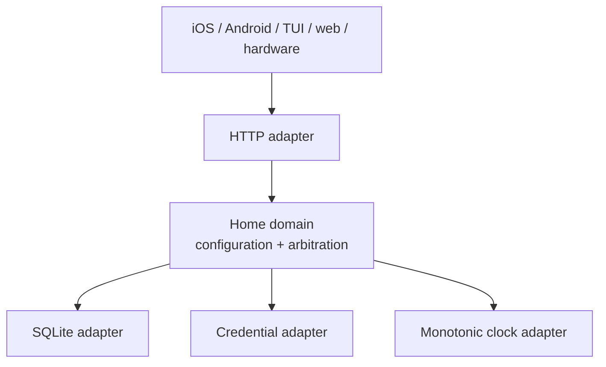
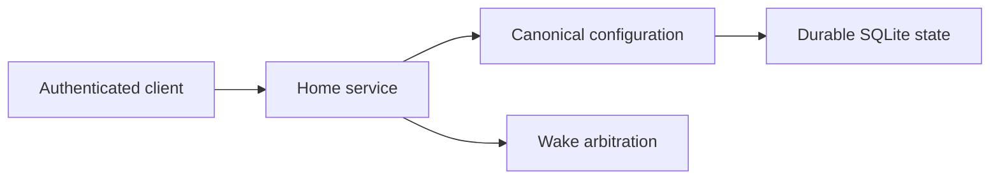

# Architecture Spine — Hermes Relay Home

## Design Paradigm

Use ports-and-adapters with small functional cores.

- Domain code owns configuration validation, revision rules, claim eligibility,
  and arbitration. It does not import an HTTP framework, SQLite driver, or
  client surface.
- Adapters provide HTTP transport, SQLite durability, credential lookup, and
  monotonic time.
- The wire contract is versioned independently of the Python implementation.



## Invariants & Rules

### AD-1 — The Home service is the sole household authority [ADOPTED]

- **Binds:** Configuration reads, configuration writes, and wake arbitration.
- **Prevents:** Clients becoming competing mutable authorities with divergent
  household state or winner selection.
- **Rule:** The service owns the active configuration revision and every
  arbitration decision. Clients may cache snapshots for presentation only;
  they never select a household-wide winner.

### AD-2 — The versioned contract is the wire authority [ADOPTED]

- **Binds:** HTTP requests, responses, errors, and persisted contract fixtures.
- **Prevents:** An HTTP framework or client platform becoming the source of
  truth for payload shape and compatibility.
- **Rule:** Versioned schemas and contract documentation define the accepted
  envelope, fields, and error codes. Adapters translate to and from the
  contract; they do not invent parallel payloads.

### AD-3 — Configuration publication is revisioned and atomic [ADOPTED]

- **Binds:** Full-snapshot configuration replacement and restart recovery.
- **Prevents:** Lost updates, partially active snapshots, and clients reading a
  revision that was never fully committed.
- **Rule:** A publish supplies `expected_revision`. The service validates the
  complete candidate before activation, rejects stale writes with a typed 409,
  and commits the new snapshot and revision as one durable transaction.

### AD-4 — Credentials stop at their owning boundary [ADOPTED]

- **Binds:** Admin routes, claim routes, logs, diagnostics, snapshots, and
  display/client adapters.
- **Prevents:** Bearer or device credentials leaking through ordinary data
  paths or content-bearing diagnostics.
- **Rule:** Home admin and device credentials are distinct, authenticated
  through an adapter, and never serialized into URLs, snapshots, payloads,
  transcripts, audio, or ordinary logs. Invalid identity fails closed.

### AD-5 — Arbitration is bounded, monotonic, and fail-closed [ADOPTED]

- **Binds:** Simultaneous wake claims and claim outcomes.
- **Prevents:** Duplicate turns, wall-clock races, late-claim surprises, and
  unsafe promotion of a failed winner.
- **Rule:** The first valid claim opens a 250 ms window measured by the Home
  service's monotonic receive clock. Eligible claims compare acoustic proximity
  evidence, then positive per-Room Device priority where `1` is highest. A
  denied, malformed, late, revoked, unavailable, or unmapped claim is denied;
  a failed winner is not replaced without a new wake.

### AD-6 — Domain policy remains independent of clients and infrastructure

- **Binds:** Domain modules, tests, and all future Home adapters.
- **Prevents:** A framework, database, iOS screen, TUI, or firmware target
  smuggling presentation or deployment assumptions into policy.
- **Rule:** Domain behavior is deterministic under injected clock, storage, and
  credential ports. HTTP, SQLite, and client-specific concerns remain at the
  edge. No generic Hermes core is extracted until multiple consumers prove the
  boundary is cheaper than their adapters.

## Consistency Conventions

| Concern | Convention |
| --- | --- |
| Naming | Preserve contract field names on the wire; use typed snake_case domain values internally. |
| Data & formats | JSON is UTF-8; URL and documents use contract version 1; known malformed fields fail closed. |
| State & mutation | Configuration has one active revision; validation precedes activation; rejected writes do not mutate state. |
| Time | Arbitration uses a monotonic Home receive clock; device wall-clock values are observation metadata. |
| Errors & recovery | Use stable error codes; distinguish unauthorized, invalid, conflict, denied, and unavailable outcomes. |
| Security | Diagnostics are content-safe; credentials, prompts, transcripts, and audio are not persisted by this service foundation. |
| Validation | Fake ports and deterministic fixtures cover domain policy without a live Hermes endpoint. |

## Stack

| Name | Version |
| --- | --- |
| Python | 3.14 |
| SQLite | 3.x via the Python standard library |
| Home HTTP contract | v1 |
| HTTP framework | Deferred until the first adapter slice |

## Structural Seed

```text
hermes-relay-home/
  src/hermes_home/
    api/          # HTTP adapter and contract translation
    domain/       # configuration and arbitration functional cores
    storage/      # SQLite adapter
    auth/         # credential lookup and fail-closed identity boundary
  tests/          # domain, adapter, and contract tests
  docs/contracts/v1/  # versioned wire contract and schemas
```



## Capability Map

| Capability / area | Lives in | Governed by |
| --- | --- | --- |
| Configuration read and atomic publish | `domain/`, `storage/`, `api/` | AD-1, AD-2, AD-3, AD-4 |
| Wake claim validation and winner selection | `domain/`, `auth/`, `api/` | AD-1, AD-4, AD-5, AD-6 |
| Restart-safe state | `storage/` | AD-1, AD-3, AD-6 |
| iOS/Android/TUI/web/hardware integration | Client repositories and adapters | AD-1, AD-2, AD-4 |

## Operational Envelope

- Development binds to loopback. LAN binding is an explicit deployment choice
  inside the private household trust boundary.
- The first service implementation uses SQLite and deterministic fakes; it does
  not require a broker, cloud database, or live Hermes endpoint.
- A process restart must recover the last committed configuration and return
  safely to an idle arbitration state.

## Deferred

- Exact HTTP framework and production process manager.
- Device credential issuance, rotation, expiry, and revocation propagation.
- Acoustic evidence encoding, calibration, normalization, and tie-band policy.
- Push notification or subscription routes.
- Display/firmware extraction from the TUI repository.
- A shared `hermes-relay-core` package or cloud/multi-household deployment.
