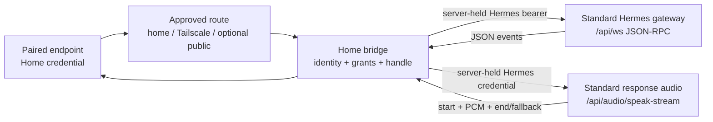

# Route and Session State

This companion carries the route records, bridge boundary, state transitions,
protocol-preservation matrix, and failure cases for the Home Bridge and Route
Roaming slice. The planned endpoint envelope is defined in
`bridge-contract.md`; identity proof and route discovery remain separate
decisions.

The planned front-end wire shape is recorded in
`bridge-contract.md`; it is coordination material, not a
claim that the public WebSocket adapter is currently served. The live Story 2
implementation is the internal `HomeBridge` seam and its separate Standard
gateway/audio sockets.

The planned front-end wire shape is recorded in
`bridge-contract.md`; it is coordination material, not a
claim that the public WebSocket adapter is currently served. The live Story 2
implementation is the internal `HomeBridge` seam and its separate Standard
gateway/audio sockets.

## Records

| Record | Required meaning |
| --- | --- |
| Approved Route | An explicitly enabled path from a paired endpoint to the one Household Server, with an ordered class (`home`, `tailscale`, or `public`) and a visible route identity. |
| Household Identity | The authority identity that an approved route must prove before Home or Hermes traffic is accepted. Its proof mechanism is open. |
| Route Attempt | One bounded attempt to reach a configured route, with outcome `reachable`, `unavailable`, `unauthorized`, `identity_mismatch`, or `timed_out`. |
| Bridge Session | The endpoint-facing connection bound to an authorized opaque conversation handle and the server-side Standard Hermes Session. |
| Turn Delivery State | Separate evidence about whether a turn was accepted, completed, interrupted, failed, or left uncertain. It never follows from route readiness alone. |

## Route selection

1. Load the paired endpoint's current approved route set.
2. Try the highest-priority reachable route: home network, then Tailscale,
   then public only when explicitly enabled.
3. Prove the route reaches the same Household Identity before accepting it.
4. Authenticate the endpoint to Home with its limited device credential.
5. Report the selected route and the actual Home/bridge state.
6. If no approved route is both reachable and identity-valid, report
   `unavailable` or `disconnected`; do not attempt an unconfigured route.

An endpoint may prefer a newly reachable higher-priority route on a later
connection boundary, but a route switch does not imply a new household,
Profile, or turn. The final discovery and identity mechanism is an open
question and must be added without changing this ordering or ownership rule.

## Boundary diagram

The endpoint-facing route and the Home-to-Hermes route are separate concerns.
This slice defines the former and the transparent bridge boundary; it does not
turn a backend Hermes route into a second household authority.

## Connection state

| State | Entry | Allowed next states | Required behavior |
| --- | --- | --- | --- |
| `unconfigured` | No approved route or endpoint credential is available. | `connecting`, `unavailable` | Explain the missing setup; do not try a public route by default. |
| `connecting` | A route attempt is in progress. | `ready`, `connecting`, `unavailable`, `disconnected` | Bound the attempt and identify the route being tried. |
| `ready` | Route identity, device authorization, and bridge/Hermes readiness are valid. | `connecting`, `disconnected`, `unavailable`, `ready` | Accept new user turns and expose the active route; do not claim old-turn delivery from readiness alone. |
| `disconnected` | The active transport ended or the route disappeared. | `connecting`, `unavailable` | Preserve uncertainty honestly; no automatic replacement turn or old-response replay. |
| `unavailable` | No safe route, identity proof, authorization, or Hermes Session is available. | `connecting`, `unconfigured` | Return a safe reason and require a fresh readiness transition before a new turn. |
| `turn_uncertain` | A transport loss may have occurred after a turn was sent. | `connecting`, `unavailable`, `ready` | Keep the turn unresolved; recovery may restore transport but never silently resend it. |

`turn_uncertain` is delivery state, not a replacement for connection state. A
client may be `ready` for a later fresh turn while an earlier turn remains
uncertain.

## Protocol-preservation matrix

| Direction | Standard shape at the pinned baseline | Bridge rule |
| --- | --- | --- |
| Home ↔ Standard gateway | `/api/ws` JSON-RPC: `gateway.ready`, session create/resume, `prompt.submit`, and `session.interrupt` | Home authorizes the endpoint and supplies server-side identity/context without exposing the Hermes credential. One reader owns the gateway stream. |
| Standard gateway → endpoint | JSON event envelopes for message start/delta/interim/complete, status/tool activity, terminal outcomes, and errors | Preserve event identity, correlation, cumulative-preview meaning, and ordering; do not translate into a Home-specific assistant dialect. |
| Home ↔ Standard audio sidecar | `/api/audio/speak-stream`: incremental text, done/stop controls, start metadata, binary raw signed-16 little-endian PCM, and end/fallback | Keep audio on the separate socket, preserve sample rate/channel metadata, byte order, stream boundaries, and turn ownership. |
| Standard gateway ↔ endpoint | Correlated approval/clarify/secret/sudo prompts and explicit `command.dispatch` when advertised | Preserve prompt sensitivity, options/values, and command authority only when the capability is advertised; never turn either into ordinary model input. |
| Standard gateway/audio → endpoint | No `speech_timing` event in the pinned baseline | Expose explicit timing absence. A verified playback-clock or duration adapter may add capability evidence; network arrival never supplies timing authority. |

The versioned Home authorization and route envelope is the JSON-RPC and audio
framing in `bridge-contract.md`. It must not rename, reinterpret, or duplicate
the Standard gateway or audio-sidecar events above.

The v1 endpoint shape is the JSON-RPC and audio framing in
`bridge-contract.md`. It uses `/api/v1/bridge/ws`, authenticates with
the `Authorization: Device` header, keeps opaque conversation/turn handles at
the endpoint, and never exposes the runtime Profile or Hermes Session IDs.

When the planned endpoint adapter is implemented, its JSON audio notifications
use `method: "audio.frame"` with the original sidecar `kind` values (`start`,
`end`, `fallback`, and `unavailable`) and carry raw PCM as binary frames between
the start and terminal notifications. It must not turn those Standard frame
kinds into new `audio.start`, `audio.end`, or `audio.fallback` Hermes methods.

When the planned endpoint adapter is implemented, its JSON audio notifications
use `method: "audio.frame"` with the original sidecar `kind` values (`start`,
`end`, `fallback`, and `unavailable`) and carry raw PCM as binary frames between
the start and terminal notifications. It must not turn those Standard frame
kinds into new `audio.start`, `audio.end`, or `audio.fallback` Hermes methods.

Text preview events retain the Standard gateway's cumulative-draft and
replacement semantics. An endpoint replaces its preview or appends only a
verified new suffix; it must not print each cumulative frame as a separate
message. Final message and turn events remain the authority for completed text.

## Recovery and uncertain delivery

| Situation | Bridge response | Automatic turn replay? |
| --- | --- | --- |
| Current route disappears before a turn is sent | Mark disconnected, select another approved route, and return to ready if identity and authorization pass. | No turn exists to replay. |
| Transport ends before the `prompt.submit` response confirms acceptance | Mark the turn uncertain and recover the connection if possible. | Never. A fresh user action is required. |
| Transport ends after prompt acceptance but before a terminal message event | Keep the turn outcome unresolved; reconnect may reuse the logical Session/cursor if the Standard session allows it, but no old response is replayed. | Never. |
| New route is reachable but identity proof fails | Reject that route and try the next approved route, if any. | No. |
| Home authorization is revoked or expired | Return unavailable, stop reachable local work, and require fresh authorization. | No. |
| Hermes Session is unavailable after Home is ready | Report unavailable with a safe reason; do not attach to another Profile or Session. | No. |
| Collector, diagnostics, or health sink is unavailable | Report the live connection/turn state and continue or fail the turn according to the Hermes transport result. | Never because of telemetry. |

Reconnect may carry the pinned Standard gateway's session identifier or cursor
when the server supports them. That cursor is for session continuity and
duplicate suppression; it is not permission to submit the uncertain prompt
again or replay an old response.

## Fixture matrix

| Fixture | Proof |
| --- | --- |
| Home route reachable | Home route wins; status names home. |
| Home route unavailable, Tailscale reachable | Tailscale wins after same-identity proof; no second Home authority appears. |
| Public route configured and reachable | Public route is used only after higher-priority routes fail and the household enabled it. |
| Public route not configured | No public attempt occurs; endpoint reports unavailable/disconnected. |
| Wrong Household Identity | Route is rejected; next approved route may be tried; no session or turn is created through the wrong route. |
| Valid credential and conversation handle | Bridge reaches ready and carries a Standard JSON-RPC text turn. |
| Response audio and timing-capability fixture | JSON, sidecar PCM bytes, audio metadata, and explicit timing absence remain correlated; word offsets are accepted only from a verified adapter. |
| Structured prompt fixture | Prompt request/response IDs and sensitivity/options survive the bridge unchanged. |
| Loss before acceptance | Turn becomes uncertain; reconnect sends no replacement turn. |
| Loss after acceptance | Session may reconnect, but the old response is not replayed and a fresh user turn waits for ready. |
| Revoked endpoint | New bridge activity is rejected and reachable work is stopped. |
| Diagnostics outage | Live turn is not blocked or replayed because telemetry failed. |
