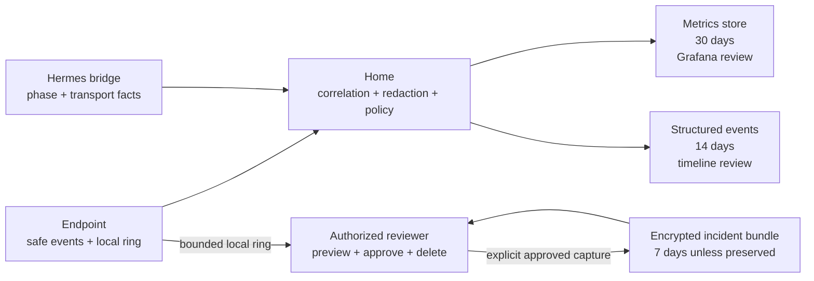
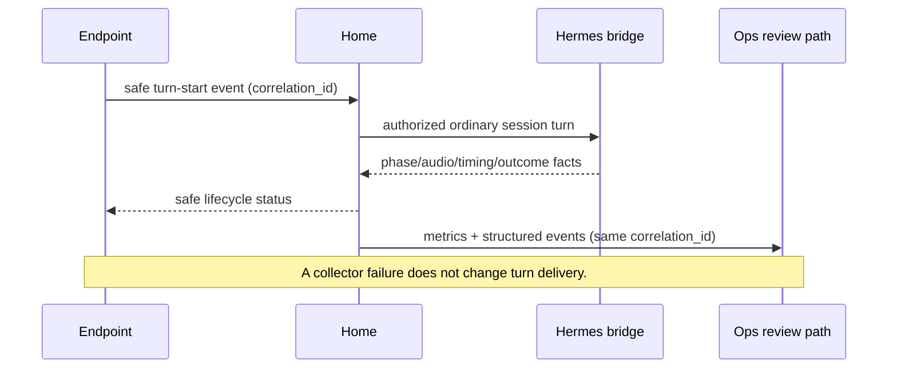

# Diagnostics Contract

This companion defines the three linked but separately governed diagnostics
paths: automatic safe telemetry, remote review, and explicit incident capture.
It does not choose the final collector, log store, bundle store, cryptographic
primitive, or trusted-surface role model.

## Boundary diagram

Automatic telemetry never feeds the bundle path by implication. An explicit
capture may select private evidence, but it remains scoped, previewed,
encrypted, and visible to the person authorizing it.

## Safe event envelope

Every automatic record has a versioned envelope and one correlation ID shared
by the endpoint, Home, and Hermes bridge for the same request. Identifiers are
opaque or non-reversible.

| Field group | Allowed automatic content |
| --- | --- |
| Identity | Schema version, correlation ID, opaque endpoint/session/turn fingerprints, event ID, source boundary, app/service version. |
| Lifecycle | Phase transition, start/end or duration, typed outcome, typed failure code, interruption or unavailable reason. |
| Route | Approved route class and safe route identity; no bearer, URL secret, or private network credential. |
| Health | Probe name, safe result, bounded failure boundary, and safe next-action code. |
| Media/transport | Audio or frame byte counts, segment counts, transport status, queue depth, upload outcome, and bounded loss counters. |
| Review metadata | Retention class, retention deadline, collector reachability, and deletion/preservation state. |

The automatic schema rejects prompts, transcript text, raw audio, credentials,
keys, Sensitive Entry values, private notification content, and reversible
household identifiers. A field that merely changes name but carries forbidden
content is still invalid.

## Lifecycle correlation

Healthy, failed, interrupted, and unavailable outcomes all produce the same
shape of lifecycle evidence. A missing event is itself visible through bounded
queue-loss or upload-status signals; the system does not fabricate a healthy
record after an outage.

## Storage and retention matrix

| Path | Automatic? | Content policy | Retention | Review behavior |
| --- | --- | --- | --- | --- |
| Safe metrics | Yes | Low-cardinality safe fields only; no content. | 30 days | Trend and health review through existing ops/Grafana boundary. |
| Structured event timeline | Yes | Safe lifecycle fields and typed failures; no content-bearing fields. | 14 days | Correlation-linked reconstruction of route, phases, latency, and failure. |
| Local pre-failure ring | No upload by itself | Bounded local evidence for one endpoint/current task or session; may contain selected detailed material only after explicit capture. | Ephemeral until capture or overwrite | Preview before any upload; loss is visible. |
| Incident bundle | No; explicit approval required | Selected evidence for one endpoint/current task or session, encrypted. | 7 days unless preserved | Separate upload/review path; explicit preserve and delete with audit. |

Metrics, timelines, and bundles have different access and deletion policies.
Deleting a dashboard view is not deletion; the stored record and any indexed
copy in the review path must be removed or rendered inaccessible according to
the chosen backend contract.

## Incident capture lifecycle

| State | Entry | Allowed next states | Rule |
| --- | --- | --- | --- |
| `idle` | No incident capture is active. | `armed`, `previewing` | Safe telemetry continues normally. |
| `armed` | Authorized person targets one endpoint and current task/session. | `previewing`, `cancelled`, `expired` | The scope is fixed; it cannot expand to another endpoint or historical task. |
| `previewing` | System assembles selected details and the bounded 60-second ring. | `approved`, `cancelled`, `expired` | Nothing is uploaded; the person can see what will leave the household. |
| `approved` | Person confirms the selected contents. | `encrypting`, `cancelled` | Approval is explicit and tied to the fixed scope. |
| `encrypting` | Bundle is sealed through the separate diagnostics path. | `uploading`, `failed` | Live Hermes state is untouched. |
| `uploading` | Encrypted bundle is sent to the review store. | `uploaded`, `failed` | Retry policy is bounded and does not resend a Hermes turn. |
| `uploaded` | Bundle has a visible seven-day deadline. | `preserved`, `deleted`, `expired` | Preservation and deletion are explicit, audited operations. |
| `failed` | Preview, encryption, or upload failed. | `previewing`, `cancelled`, `expired` | Report the failure; do not change the live Session. |

## Failure behavior

| Failure | Required result |
| --- | --- |
| Automatic collector unreachable | Live turn continues or fails according to Hermes transport; queued count/loss is visible. No turn retry or replay. |
| Local safe-event queue full | Apply the bounded loss policy, expose dropped count, and keep the live turn independent. |
| Automatic schema rejects a forbidden field | Drop or quarantine the diagnostic record, report a redaction failure, and never block the live turn. |
| Metrics store unavailable | Metrics status becomes unavailable; structured event and live-turn behavior remain independent. |
| Timeline store unavailable | Upload status reports the failure; no automatic content-bearing fallback is attempted. |
| Incident preview cancelled | No selected evidence leaves the endpoint; the live Session is unchanged. |
| Incident encryption or upload fails | Bundle remains local or is discarded according to the visible capture state; retry is only for the bundle path, never Hermes. |
| Bundle deleted | Stored review-path data is removed or rendered inaccessible and the deletion is auditable. |
| Endpoint revoked during capture | Home stops authorization for new capture activity; pending bundle behavior follows the explicit security policy and cannot restore endpoint access. |

## Fixture matrix

| Fixture | Proof |
| --- | --- |
| Healthy text turn | Safe lifecycle record, metrics, and timeline share one correlation ID. |
| Successful voice turn | Audio/frame byte counts and timing facts appear; raw PCM and transcript do not. |
| Failed, interrupted, and unavailable turns | Each has typed outcome/failure evidence and no false success record. |
| Forbidden automatic field | Schema rejects prompt, transcript, audio, credential, key, Sensitive Entry, private notification, or reversible identifier. |
| Collector outage | Live turn remains independent; last upload, queue, reachability, and loss status are honest. |
| 60-second ring buffer | Buffer is bounded, local, and not uploaded until explicit preview and approval. |
| Preview cancellation | No bundle is uploaded and live turn state is unchanged. |
| Approved incident | Selected current task/session evidence is encrypted, uploaded separately, and gets a seven-day deadline. |
| Preservation | Bundle deadline changes only through explicit authorized preservation. |
| Deletion | Bundle disappears from the review path and an audit result remains. |
| Endpoint revocation | New diagnostic authorization is rejected; no late capture action mutates Home state. |
